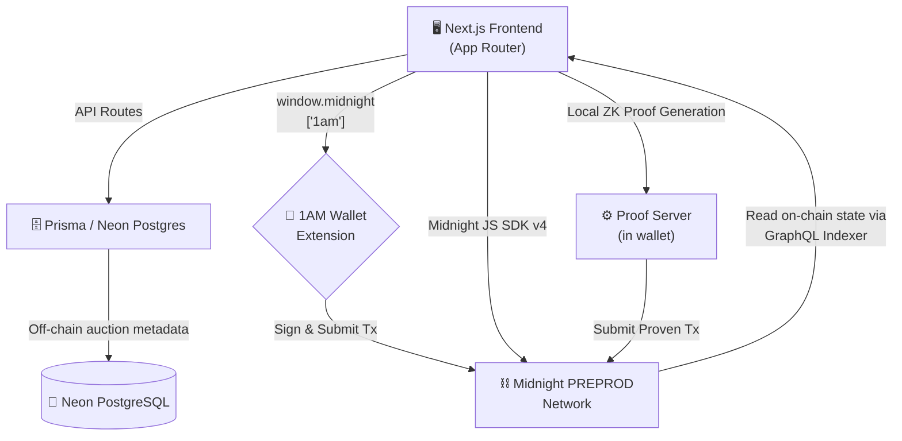
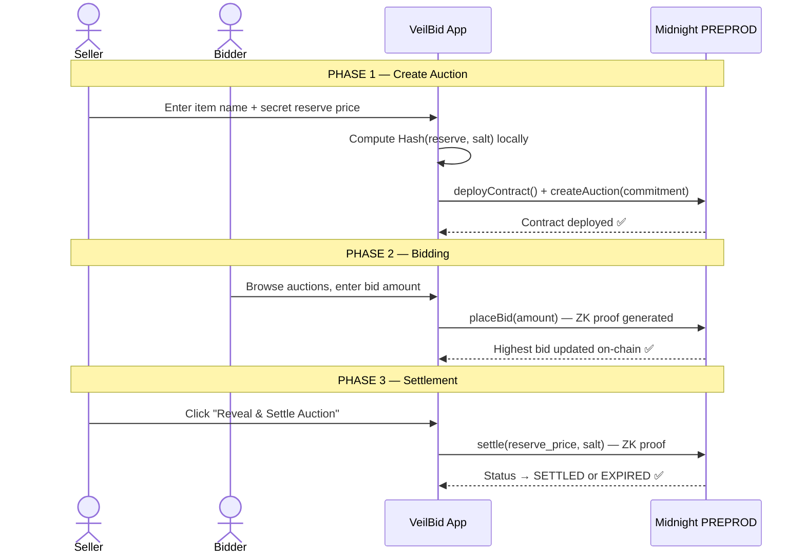

<div align="center">
  

  # VeilBid
  ### Zero-Knowledge Private Reserve Auctions on the Midnight Network

  <br />

  [](https://github.com/SUMAN967-GHOSH/VeilBid/actions/workflows/tests.yml) [](https://github.com/SUMAN967-GHOSH/VeilBid/actions/workflows/typecheck.yml) [](https://github.com/SUMAN967-GHOSH/VeilBid/actions/workflows/lint.yml) [](https://github.com/SUMAN967-GHOSH/VeilBid/actions/workflows/build.yml)

  <br />

       
</div>

---

## 🔗 Quick Links

| Resource | Link |
|:---|:---|
| 🌐 **Live App** | [veil-bid.vercel.app](https://veil-bid.vercel.app/) |
| 📜 **PREPROD Contract** | [`ac616d0e...533ba`](https://explorer.1am.xyz/contract/ac616d0ed7625c97c6188df5253077ce140ac64d73390ae925631caf4e3533ba) |
| 🔍 **PREPROD Explorer** | [preprod.midnightexplorer.com](https://preprod.midnightexplorer.com) |
| 🎥 **Demo Video** | [Watch on Google Drive](https://drive.google.com/file/d/1s2vG85VgwU9I50-nKdo1P39mvH9C8S10/view?usp=sharing) |
| 📖 **Setup Guide** | [SETUP.md](./SETUP.md) |
| 📖 **Usage Guide** | [USAGE.md](./USAGE.md) |

---

## 💡 Why VeilBid?

### ❌ The Problem with Transparent Blockchains

Traditional on-chain auctions are fundamentally broken because **everything is public**:

- 🔴 **Exposed Reserve Prices** — Bidders see the seller's minimum and bid just enough to win, destroying market value.
- 🔴 **Strategic Last-Second Sniping** — Bidders watch on-chain activity and wait until the final block to swoop in.
- 🔴 **Identity Leaks** — Public wallet addresses expose bidder identities, wealth, and bidding strategies forever.
- 🔴 **MEV Front-running** — Bots read pending transactions and maliciously outbid real users before their tx confirms.

### ✅ The VeilBid Solution

VeilBid uses the **Midnight Network's Zero-Knowledge Proof system** to build an auction platform where privacy is a cryptographic guarantee — not a promise:

- 🟢 **Hidden Reserve Prices** — Sellers commit to a reserve via `Hash(price, salt)`. The price itself never touches the chain.
- 🟢 **Verifiable Settlement** — The ZK circuit proves whether the bid met the reserve *without revealing the reserve value*.
- 🟢 **Shielded Identities** — Bidders appear on-chain as `Hash(secret_key)`, a contract-specific ephemeral key with zero link to their wallet.
- 🟢 **Tamper-Proof Commitment** — The reserve price is cryptographically bound to the commitment — it cannot be changed after auction creation.

---

## 🔒 Privacy Model

VeilBid uses Midnight's hybrid (public/private) state model. Here is *exactly* what is visible and what stays hidden:

<table>
<tr>
<th>👁️ Visible On-chain (Public Ledger)</th>
<th>🔒 Hidden (Zero-Knowledge Only)</th>
</tr>
<tr>
<td>

- `reserve_commitment` — Hash of (price + salt)
- `highest_bid` — Leading bid amount in micro-tNIGHT
- `highest_bidder` — ZK-derived ephemeral key
- `status` — `OPEN` / `SETTLED` / `EXPIRED`
- `auction_end_block` — Block deadline
- `bid_count` — Total bids placed
- `item_hash` — Hash of item description

</td>
<td>

- **The actual reserve price** — never broadcast
- **The private salt** — stays on seller's device
- **Real wallet addresses** — hidden behind ZK key
- **Bid history linkage** — impossible to cross-reference
- **Whether you've bid** — private participation

</td>
</tr>
</table>

---

## 📜 Smart Contract (Compact ZK)

The VeilBid smart contract is written in **Compact** — Midnight's ZK domain-specific language. It runs inside the user's browser via the proof server and generates cryptographic proofs that verify on the Midnight blockchain.

### 5 ZK Circuits

| # | Circuit | Who Calls It | What It Proves |
|:--|:--------|:------------|:---------------|
| 1 | `createAuction` | Seller | `Hash(reserve_price, salt) == commitment` stored on-chain |
| 2 | `placeBid` | Any bidder | `bid > highest_bid` AND `block_number ≤ end_block` |
| 3 | `settle` | Seller | `Hash(price, salt) == commitment` AND reveals win/loss outcome |
| 4 | `withdrawExpired` | Seller or Bidder | Caller is authorized AND auction is in EXPIRED state |
| 5 | `cancelAuction` | Seller only | Caller is the seller AND auction is still OPEN |

### Deployed on Midnight PREPROD

> **Network:** Midnight PREPROD (pre-production testnet — mirrors Mainnet)

| Detail | Value |
|:---|:---|
| **Contract Address** | `ac616d0ed7625c97c6188df5253077ce140ac64d73390ae925631caf4e3533ba` |
| **Explorer** | [View on 1AM Explorer ↗](https://explorer.1am.xyz/contract/ac616d0ed7625c97c6188df5253077ce140ac64d73390ae925631caf4e3533ba) |
| **Network** | Midnight PREPROD |

> **Why PREPROD?** PREPROD is the final staging network before Midnight Mainnet. It runs the same protocol as Mainnet, making it the ideal environment for production-grade testing and launches.

---

## 🏗️ Architecture

### System Architecture



### Auction Lifecycle



---

## ✨ Features

### Core Features (Live on PREPROD)

| Feature | Description |
|:--------|:------------|
| 🔐 **Private Reserve Commitment** | Reserve price is hashed with a random salt — cryptographically bound, never revealed |
| 🕵️ **Shielded Bidder Identity** | On-chain identity is `Hash(secret_key)` — completely decoupled from wallet address |
| ⛓️ **On-chain Block Expiry** | `placeBid` and `settle` both verify `block_number` on-chain — no early settlements |
| ❌ **Cancel Auction** | Sellers can cancel an open auction at any time before expiry |
| 🔗 **Share Auction Link** | One-click copy of a shareable link that auto-loads the auction by contract address |
| 📊 **Live Auction Dashboard** | Real auction state fetched from the Midnight indexer — no mock data |
| 🏦 **Seller Command Center** | Dashboard showing all your deployed auctions, synced from both DB and chain |
| 🔒 **Wallet Auto-Reconnect** | Remembers your 1AM wallet session across page refreshes |

### 🎉 What's New in v2 (Preprod Release)

| Feature | Description |
|:--------|:------------|
| 🛡️ **Secure Key Derivation** | ZK secret key derived from wallet signing API, not from public address |
| 📝 **Auction Categories** | Tag auctions by category (Art, NFT, Corporate, DeFi, Real Estate) |
| 🖼️ **Item Image Support** | Attach an image URL to your auction listing |
| 🔍 **Filter by Status/Network** | Filter auctions by OPEN / SETTLED / EXPIRED from the API |
| ⚡ **Quick Bid Increments** | One-tap +10 / +50 tNIGHT bid buttons in the bid modal |
| 📡 **Real Transaction Hashes** | All transactions now return and display the actual on-chain tx hash |
| 🧱 **Error Boundaries** | Production-grade error isolation — one failing auction can't crash the whole page |
| 🗂️ **Expanded DB Schema** | 8 new production fields: network, status, endBlock, category, imageUrl, and more |

---

## 📁 Repository Structure

```text
VeilBid/
├── app/                         # Next.js App Router (Frontend)
│   ├── api/auctions/route.ts    # REST API with filter support
│   ├── auctions/page.tsx        # Main auction dashboard
│   ├── dashboard/page.tsx       # Seller command center
│   └── page.tsx                 # Landing page
├── components/                  # Reusable UI components
│   ├── AuctionCard.tsx          # Auction display card with share button
│   ├── BidModal.tsx             # Bid modal with quick increment buttons
│   ├── CreateAuctionModal.tsx   # Auction creation form
│   ├── ErrorBoundary.tsx        # Production error isolation
│   └── ToastProvider.tsx        # Global toast notifications
├── contract/
│   └── src/
│       ├── auction.compact      # ✅ Core Midnight ZK Smart Contract (5 circuits)
│       └── auction.test.ts      # ZK logic tests (17 test cases)
├── hooks/
│   └── useWallet.ts             # 1AM wallet connection with auto-reconnect
├── lib/
│   ├── auction-api.ts           # Midnight SDK integration + ZK circuit calls
│   ├── providers.ts             # PREPROD network config + wallet providers
│   └── types.ts                 # Shared TypeScript types
├── prisma/
│   └── schema.prisma            # Production Postgres schema (14 fields)
├── scripts/
│   └── deploy.ts                # PREPROD deployment guide script
└── public/v2/keys/              # Compiled ZK circuit keys (prover + verifier)
```

---

## ✅ Testing

The VeilBid smart contract logic is tested with **17 exhaustive test cases** covering all 5 ZK circuits and security edge cases.

```bash
npm install
npm test
```

**Test Coverage:**

| Test Suite | Cases | Description |
|:-----------|:-----:|:------------|
| Contract Initialization | 2 | Seller identity and state defaults |
| Create Auction | 3 | Commitment correctness, access control, duration validation |
| Place Bid | 3 | Bid ordering, seller exclusion, block expiry enforcement |
| Settle Auction | 3 | Commitment verification, reserve met/not met outcomes |
| Withdraw Expired | 2 | Authorization checks |
| Cancel Auction | 2 | Seller cancel, unauthorized cancel rejection |
| Environment | 2 | Node v22+, test framework sanity |

**Result: 17/17 PASS ✅**

---

## 🚀 Getting Started

See **[SETUP.md](./SETUP.md)** for the full local development guide.

**Quick start:**
```bash
git clone https://github.com/SUMAN967-GHOSH/VeilBid.git
cd VeilBid
npm install
cp .env.example .env.local
# Edit .env.local and add your DATABASE_URL
npm run dev
```

Open [http://localhost:3000](http://localhost:3000), connect your 1AM wallet (set to **Midnight Preprod**), and you are ready to go.

---

## 🔮 Roadmap

**Coming Soon:**
- 🤖 **Auto-Bidding** — Set a maximum bid limit; the contract bids incrementally on your behalf without revealing your ceiling.
- 🖼️ **Native ZK-NFTs** — Privately transfer Midnight NFT ownership to the winner upon settlement.
- 📊 **Bid Analytics** — Historical bid charts and auction performance metrics (off-chain only).
- 🌐 **Mainnet Launch** — Full deployment on the Midnight Mainnet when it goes live.

**Real-World Use Cases:**
- 🎨 **High-Value Art** — Wealthy collectors demand anonymity; sellers need hidden minimums to spark genuine bidding wars.
- 🏢 **Corporate Procurement** — Sealed-bid government and B2B contracts where pricing must remain secret until evaluation.
- 📉 **DeFi Liquidations** — Private collateral liquidation to prevent market panic and MEV front-running.
- 🏡 **Real Estate** — Confidential property auctions without exposing buyer and seller negotiation floors.

---

## 📚 Documentation

| File | Description |
|:-----|:------------|
| [README.md](./README.md) | This file — project overview, architecture, features |
| [SETUP.md](./SETUP.md) | Install 1AM wallet, get PREPROD tokens, run locally |
| [USAGE.md](./USAGE.md) | Step-by-step guide for sellers and bidders |
| [PROPOSAL.md](./PROPOSAL.md) | Original technical proposal and problem statement |

---

<div align="center">

**VeilBid — Built on [Midnight Network](https://midnight.network) 🌙**

*Where privacy is a cryptographic guarantee, not a promise.*

</div>